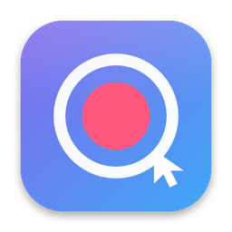

<div align="center">



# MyDemoStudio

**Press record. Get the polished cut.**

A native macOS screen recorder that re-renders your capture into a finished product
demo — auto-zoom that follows the cursor, a gradient backdrop, a smooth cursor — without
a subscription.

[](https://prot10.github.io/MyDemoStudio/)
[](docs/)
[](LICENSE)
[](#requirements)
[](#requirements)
[](docs/agents.md)

**[Website](https://prot10.github.io/MyDemoStudio/) · [Documentation](docs/) · [Roadmap](ROADMAP.md)**

</div>

---

## What it does

Most screen recorders bake their effects into the file as they capture. MyDemoStudio
writes down what happened instead — a pristine master movie plus a timestamped log of
every cursor move, click and keystroke — and applies the effects at the very end, in a
single Metal pass.

So every decision stays reversible for as long as you keep the recording. Padding, corner
radius, wallpaper, zoom strength, cursor size: all of it is a number in a JSON file, not
a pixel in a video.

## Features

- **Record** the whole screen or a single app window — captured as a display crop, so the
  window keeps its shadow, rounded corners and chrome.
- **Auto-zoom that follows the cursor.** The camera pushes in around clicks and keeps the
  pointer near the centre, with a fixed-timestep spring follow and smootherstep easing.
- **A real cursor**, drawn from the macOS arrow or pointing-hand sprite, smoothed and
  hidden when idle.
- **The look**: procedural mesh-gradient wallpapers, solid and gradient backgrounds,
  padding, rounded corners, drop shadow, optional motion blur, and 16:9 / 9:16 / 1:1 /
  original aspect ratios.
- **Webcam bubble** — a circular camera overlay in any corner.
- **Voiceover** from the microphone, plus optional soft **click and keystroke sounds**
  mixed into the export.
- **Captions** — on-device transcription with SpeechAnalyzer, burned into the video.
- **A multi-track editor** with live preview, trimming, splitting, speed, fades, titles
  and per-clip looks.
- **Export** to MP4, MOV or animated GIF at 4K / 1080p / 720p, saved wherever you choose.
- **Drivable by an AI agent** — the app is an MCP server, with 24 tools.

## Two libraries

**Clips** — every recording you make, kept as a `.mydemo` package in
`~/Movies/MyDemoStudio`. These are the originals; projects only ever reference them, so
nothing is moved or rewritten.

**Projects** — `.mdsproj` edit documents in `~/Movies/MyDemoStudio/Projects`, each
assembling clips and imported media into a finished video.

## The editor

A project is a multi-track timeline. Each clip has a source window, a playback speed,
volume, fades, and an optional per-clip look that overrides the project defaults — so one
clip can be zoomed and padded while the next is plain.

| | |
| --- | --- |
| **Tracks** | A main picture track, overlay tracks (webcam bubble, titles), and audio tracks |
| **Editing** | Drag to move, drag either edge to trim, `⌘B` to split, speed 0.25×–4×, ripple delete, close gaps |
| **Media** | Recordings from the library, plus videos, images (with a Ken Burns move) and sounds — imported files are *copied into the project* |
| **Titles** | Text cards on an overlay track, with fades |
| **After the fact** | Play the timeline and record a webcam or voiceover take over it; it lands at the playhead |
| **Reuse** | Copy a clip's look, volume, fades and placement onto another (`⇧⌘C` / `⇧⌘V`), or push one look onto every clip at once |

Speeding a clip up shortens that clip without moving the ones after it — use *close gaps
on this track* when you want the timeline to tighten up.

Full details in [docs/editor.md](docs/editor.md).

## Controlling it from an AI agent

MyDemoStudio **is** an MCP server — the app speaks the protocol itself over stdio, so any
MCP-capable agent can drive it with nothing else installed: no runtime, no package
manager, no checkout of this repo.

```json
{
  "mcpServers": {
    "mydemostudio": {
      "command": "/Applications/MyDemoStudio.app/Contents/MacOS/MyDemoStudio",
      "args": ["--mcp"]
    }
  }
}
```

In the app, **Connect an AI agent** (sidebar, or `⇧⌘M`) shows this config with the real
path already filled in, per client — Claude Code, Claude Desktop, Codex, Cursor, VS Code,
Windsurf — with the config file location for each and a button to copy it.

It exposes 24 tools covering the clip library, projects, the timeline, looks and output.
`project_render_frame` is the quickest feedback loop: it renders one frame to a PNG. The
app watches its `document.json`, so an agent's edits appear live in an open project.

The same verbs are available as a one-shot CLI, which is what scripts should use:

```sh
MyDemoStudio --cli clips.list --json '{}'
MyDemoStudio --cli project.export --json '{"project":"Demo","format":"mp4","preset":"1080p"}'
```

Every client's config and the full tool reference: [docs/agents.md](docs/agents.md).

## Requirements

- macOS 26 or later, Xcode 26.
- The Metal Toolchain component (`xcodebuild -downloadComponent MetalToolchain`).
- On first run, grant Screen Recording, Accessibility, and — optionally — Camera and
  Microphone. Screen Recording takes effect after a relaunch.

## Build

There is no signed release yet, so you build it yourself.

```sh
git clone https://github.com/Prot10/MyDemoStudio.git
cd MyDemoStudio

# one-off: the shader compiler
xcodebuild -downloadComponent MetalToolchain

xcodebuild -project MyDemoStudio.xcodeproj \
  -scheme MyDemoStudio -configuration Release \
  -allowProvisioningUpdates build
```

Then move the app to `/Applications` and launch it from there. macOS ties permission
grants to the app's signature *and* its path, so running from a stable location means you
grant once instead of after every rebuild.

## Architecture

The core idea is **record raw, then re-render**: capture a pristine master movie plus a
timestamped log of every cursor move, click and keystroke (synced on the mach host
clock), then rebuild the polished video by applying every effect in a single Metal pass
at export and preview time. The master is never modified.

| Directory | Holds |
| --- | --- |
| `Capture/` | ScreenCaptureKit recording, `CGEventTap` input logging, webcam and voiceover capture, permissions, caption transcription |
| `Render/` | The Metal compositor and shaders, the zoom planner, cursor smoother, composition builders, audio mixers, exporters |
| `Model/` | The `.mydemo` recording package, the `.mdsproj` edit document, and all settings |
| `UI/` | The SwiftUI libraries, both editors, the multi-lane timeline, the inspector |
| `site/` | The promo site — Vite + React + Tailwind, deployed to GitHub Pages |
| `mcp/` | An earlier Node bridge, superseded by the native server |

More in [docs/architecture.md](docs/architecture.md).

## Tests

Everything is validated headlessly, by rendering real files and reading the pixels and
samples back out:

```sh
MDS_SELFTEST=algo     MyDemoStudio.app/Contents/MacOS/MyDemoStudio   # zoom + cursor maths
MDS_SELFTEST=timeline MyDemoStudio.app/Contents/MacOS/MyDemoStudio   # multi-clip render + export
MDS_SELFTEST=editor   MyDemoStudio.app/Contents/MacOS/MyDemoStudio   # editor glue, undo, autosave
MDS_SELFTEST=1        MyDemoStudio.app/Contents/MacOS/MyDemoStudio   # full record→export (needs permissions)
```

There is also a stability run — 60 rounds of window resizing, real split-divider drags,
and rapid edits / undo / split / seek against a live editor:

```sh
MDS_BYPASS_PERMS=1 MDS_STRESS=1 MDS_SELECT_PROJECT="My project" …
```

## The website

The promo site lives in `site/` and deploys to GitHub Pages on every push to `main`.

```sh
cd site
npm install
npm run dev      # http://localhost:5310
```

## Documentation

- [Recording](docs/recording.md) — what to capture, permissions, webcam, voiceover
- [The look](docs/the-look.md) — wallpapers, framing, auto-zoom, cursor, captions
- [The editor](docs/editor.md) — tracks, trimming, speed, titles, shortcuts
- [Exporting](docs/exporting.md) — formats, resolutions, where files go
- [Agents and the CLI](docs/agents.md) — MCP clients, the 24 tools, one-shot commands
- [Architecture](docs/architecture.md) — how the render pipeline works
- [Troubleshooting](docs/troubleshooting.md) — permissions, build failures, black frames

## Contributing

Bug reports and pull requests are welcome — see [CONTRIBUTING.md](CONTRIBUTING.md).
Planned work is in [ROADMAP.md](ROADMAP.md).

## License

Licensed under the **GNU Affero General Public License v3.0** — see [LICENSE](LICENSE).

In short: you are free to use, study, modify and share it, but any distributed or
network-served derivative **must remain open source under the same license**. This
deliberately prevents closed-source commercial repackaging.

## Support

[](https://buymeacoffee.com/prot10)
[](https://paypal.me/andreaprotani99)

- ⭐ Star the repo — it is the cheapest way to help
- 🐛 [Report a bug](https://github.com/Prot10/MyDemoStudio/issues)
- ☕ [Buy me a coffee](https://buymeacoffee.com/prot10) or [PayPal](https://paypal.me/andreaprotani99)

---

<div align="center">

Made by [Andrea Protani](https://github.com/Prot10), alongside
[MyMacCleaner](https://github.com/Prot10/MyMacCleaner) and
[MyTripPlanner](https://github.com/Prot10/MyTripPlanner).

Not affiliated with Screen Studio or Apple.

</div>
